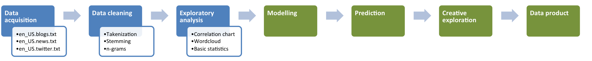

```{r echo=FALSE, message=FALSE}
setwd('H:/Machine_Learning/SwiftKey')
require(tm); require(SnowballC); require(data.table)
require(ggplot2); require(RWeka); require(qdap);
require(scales); require(gridExtra); require(wordcloud);require(reshape2)
source('./SwiftKey-Natural-language/Task_1.5_Tokenization_func.R')
```

### Introduction
This report mainly provides a preliminary research regarding SwiftKey's NLP project.

The SwiftKey's NLP project is aimed to implement **NLP (Natural language processing)** techniques to build an algorithm in R environment. The algorithm will be trained by a larged amounts of collected text/documents and eventually, it will be able to make predictions of words that users are most likely to type. 

In this report, the basic research such as preprocess of raw data, preliminary statistics/visualization analysis, plans for algorithm and applications are introduced in order to provide readers with overall concepts about the project.

##### Main steps of SwiftKey's NLP project. 



### Preprocess
The preprocess for text mining mainly includes **cleaning, tokenization and stemming**. These steps are implemented to clean the collections of text documents provided and transfer the documents into a form of text segmentation which can be used for further analysis easily. To be more specific, the following issues in text documents will be solved during preprocess:

- Capital/Lower case
- Numbers
- Punctuations
- Whitespace
- Profanity words
- Special notation/Noise like mistypes, UTF-16 encoded characters, foreign words, etc.

To overcome all issues above, function **tokenization()** has been constructed and following is an output of applying this function on our documents.
 
```{r echo=FALSE}
setwd('H:/Machine_Learning/SwiftKey')
en_US <- file.path('.','SwiftKey-Natural-language','Other','en_US_s')
en_US.document <- Corpus(DirSource(en_US, encoding="UTF-8"), 
                         readerControl = list(reader = readPlain,language = "en_US",load = TRUE))
docs <- en_US.document
trans <- c(F,T,T,T,F,F,T,T)
ChartoSpace <- c('/','\\|')
stopWords <- 'english'
ownStopWords <- c()
swearwords <- read.table('./SwiftKey-Natural-language/profanity filter/en', sep='\n')
names(swearwords)<-'swearwords'
filter <- rep('***', length(swearwords))
profanity <- data.frame(swearwords, target = filter)
profanity <- rbind(profanity, data.frame(swearwords = c("[^[:alpha:][:space:]']","â ","ã","ð"), target = c(" ","'","'","'")))
tokenized_docs <- tokenization(docs, trans, ChartoSpace, stopWords, ownStopWords, profanity)
```

After tokenizations, **stemming** is applied to documents to remove common words endings for English words, such as "es", "ed" and "s". 

```{r echo=FALSE}
stem_docs <- tm_map(tokenized_docs, stemDocument, 'english') # SnowballStemmer
```

So far, we have done the basic cleaning/transformation steps for raw documents. Next we will do some preliminary statistics analysis and data visualisation to collected data.

### Basic Statistics/Visualization
In this part, through doing some basic statistics analysis and data visualization on our data sets, we can get a brief understanding of our data. 
First, we explore the **total lines** and **number of words** in each document.

##### Total Word Count / Lines by Text Source. 

```{r echo=FALSE, warning=FALSE, fig.width=9, fig.height=2.5}
setwd('H:/Machine_Learning/SwiftKey')
load('./SwiftKey-Natural-language/Other/melt_df.RData')
melt_df
# barplot of total word counts
ggplot(melt_df,aes(x=names,y=value)) + 
    geom_bar(stat='identity',color='grey60',fill='#56B4E9') + facet_wrap(~variable, scales = "free") + 
    xlab('Source')+ylab('Word Count/Lines') + theme(legend.position='none') + 
    theme_bw() + geom_text(aes(label=format(value,big.mark=",")),size=3,labels=comma,vjust=-0.2) 
```

Second, we convert our text corpus into **Document Term Matrix** based on different **ngrams**, so that we can easily figure out the frequency and correlation between different words. 

##### Terms frequency - Wordcloud / DTM

```{r echo=FALSE, warning=FALSE, fig.width=9, fig.height=6}
setwd('H:/Machine_Learning/SwiftKey')
rm(list=ls(all=TRUE))
load('./SwiftKey-Natural-language/Other/wf_alltoken.RData')
ggplot(wf_alltoken,aes(x=word,y=freq)) + 
    geom_bar(stat='identity',color='grey60',fill='#56B4E9') + facet_wrap(~ngrams, scales = "free", ncol=1,nrow=4) + 
    xlab('Terms')+ylab('Frequency') + theme(legend.position='none', axis.title.x = element_text(size=3), axis.title.y = element_text(size=3), axis.text.x  = element_text(angle=45, hjust=1)) + 
    theme_bw() + geom_text(aes(label=format(freq,big.mark=",")),size=3 ,labels=comma,vjust=-0.2)
```
```{r echo=FALSE, warning=FALSE, fig.width=9, fig.height=3}
setwd('H:/Machine_Learning/SwiftKey')
rm(list=ls(all=TRUE));par(mfrow=c(1,4))
load('./SwiftKey-Natural-language/Other/freq_onetoken.RData')
load('./SwiftKey-Natural-language/Other/freq_bitoken.RData')
load('./SwiftKey-Natural-language/Other/freq_tritoken.RData')
load('./SwiftKey-Natural-language/Other/freq_quatrtoken.RData')
library(wordcloud); set.seed(888)
wordcloud(names(freq_onetoken), freq_onetoken, min.freq=40, colors=brewer.pal(6, 'Dark2'), rot.per=.2)
wordcloud(names(freq_bitoken), freq_bitoken, min.freq=15, colors=brewer.pal(6, 'Dark2'), rot.per=.2)
wordcloud(names(freq_tritoken), freq_tritoken, min.freq=4, colors=brewer.pal(6, 'Dark2'), rot.per=.2)
wordcloud(names(freq_quatrtoken), freq_quatrtoken, min.freq=3, colors=brewer.pal(6, 'Dark2'), rot.per=.2)
```

Above wordcloud diagrams give us a intuitive view towards the frequency of 1,2,3,4 grams terms and bar charts based on our Document Terms Matrix also display top frequent terms in our documents. 

### Further Terms Frequency Analysis
#### Word frequency distribution
```{r echo=FALSE, warning=FALSE, fig.width=9, fig.height=3}
setwd('H:/Machine_Learning/SwiftKey')
rm(list=ls(all=TRUE))
load('SwiftKey-Natural-language/Other/wf_onetoken.RData')
load('SwiftKey-Natural-language/Other/wf_bitoken.RData')
load('SwiftKey-Natural-language/Other/wf_tritoken.RData')
load('SwiftKey-Natural-language/Other/wf_quatrtoken.RData')
par(mfcol = c(1,4))
hist(log10(table(wf_onetoken[,2])), xlab="", col = "#56B4E9", 
     ylab="Number of words", main = "Unigram")
hist(log10(table(wf_bitoken[,2])), xlab="Word frequency in corpus  (log10)", col = "#56B4E9", 
     ylab="", main = "Bigrams")
hist(log10(table(wf_tritoken[,2])), xlab="", col = "#56B4E9", 
     ylab="", main = "Trigrams")
hist(log10(table(wf_quatrtoken[,2])), xlab="", col = "#56B4E9", 
     ylab="", main = "Quargrams")
load('SwiftKey-Natural-language/Other/sparcity_all.RData')
sparcity_all
rm(list=ls(all=TRUE))
```

We can see in the above plots and table how many words it would take to reach **50%** and **90%** coverage in our 1-4 grams models.<br>
For example, **124** words are needed to account for 50% of the entire Unigram corpora and **2783** words are needed to account for 90% of the entire Unigram corpora. They are the same as **1.53%** and **34.26%** of total rows in our one-word sample corpus.

### Algorithm / Application
This project is also required to develop an online application with user-friendly interface. In this project, the application will be released on a **Shiny** server. However, considering that the algorithm is built for mobile app, we have to also take the size and speed of model into account. So we only implement **2 or 3 grams** algorithms for our online application.

The main functionalities should be included in Shiny app:

- Detecting the nearest 1 to 3 words of users' typing and taking them as the inputs of model. 
- Return the predictions of model to the user interface.

##### Example: 


*<br>Tianxiang(Ivan) Liu<br>*
*13 November 2014*
