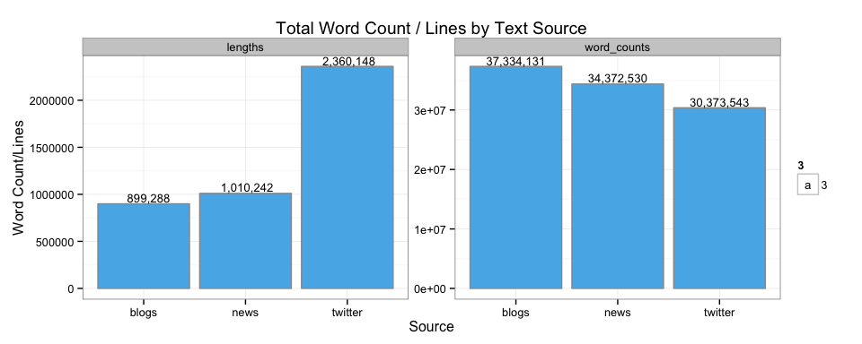

# SwiftKey NLP Milestone Report
Tianxiang(Ivan) Liu  
13 November 2014  


```
##          used (Mb) gc trigger (Mb) max used (Mb)
## Ncells 760899 40.7    1073225 57.4   760899 40.7
## Vcells 946619  7.3    1598044 12.2   946619  7.3
```

### Introduction
This milestone report introduced a preliminary research about SwiftKey's NLP project.

The SwiftKey's NLP project is mainly aimed to implement **NLP (Natural language processing)** techniques to build an algorithm in R environment. The algorithm will be trained by a larged amounts of collected text/documents and eventually, it will be able to make predictions of words that users are most likely to type. 

The word prediction project has been started and an initial assessment of the task completed. This report describes the goals of the overall project, the magnitude of the challenge, and gives some initial assessments of the results.

In this report, the basic research like preprocess of raw data, preliminary statistics/visualization analysis, plans for algorithm and applications will be introduced so that reader can have an overall concept regarding the project and where the project is heading to.

> Following flowchart gives us the main steps will be included of SwiftKey's NLP project. 


### Preprocess
The preprocess for text mining mainly includes cleaning, tokenization and stemming. The objectives of these processes are to clean the collections of text documents provided and transfer the documents into a form of text segmentation which can be used for further analysis easily. To be more specific, the following issues in text documents will be solved during preprocess:

- Capital/Lower case
- Numbers
- Punctuations
- Whitespace
- Profanity words
- Special notation/Noise like mistypes, UTF-16 encoded characters, foreign words, etc.

To overcome all issues above, function tokenization() has been constructed and following is an output of applying this function on our documents.
 

```
## 
## Please wait for initializing and summrising the input files......
## Documents below will be processed soon!
##                          Length Class             Mode
## en_US_blogs_sample.txt   2      PlainTextDocument list
## en_US_news_sample.txt    2      PlainTextDocument list
## en_US_twitter_sample.txt 2      PlainTextDocument list
## 
## Start tokenization processes...
## 
## 1.Simple Transformation: FALSE
## 2.Specific Transformations/Profanity filtering: TRUE
##  346 words will be filtered, following is a sample of the words:
##       swearwords target
## 1           2g1c    ***
## 2  2 girls 1 cup    ***
## 3 acrotomophilia    ***
## 4           anal    ***
## 5      anilingus    ***
## 
##  ->Specific Transformations/Profanity filtering have been done to raw document!
## 3.Lowercase Transformation: TRUE
##  ->All CAPITAL characters have been transformed to lower cases!
## 4.Remove Numbers: TRUE
##  ->All NUMBERs have been eliminated from raw document!
## 5.Remove Punctuations: TRUE
##  ->All Punctuations have been eliminated from raw document!
## 6.Remove Stop Words: FALSE
## 7.Remove Own Stop Words: FALSE
## 8.Strip Whitespace: TRUE
##  ->Whitespaces have been stripped from raw document!
## 
## Document has been tokenized!2 2 2 PlainTextDocument PlainTextDocument PlainTextDocument list list list
```

After tokenizations, stemming is applied to documents to remove common words endings for English words, such as "es", "ed" and "s". 


So far, we have done the basic cleaning/transformation steps for raw documents. Next we will do some preliminary statistics analysis and data visualisation to collected data.

### Preliminary Statistics/Visualization
In this part, through doing some basic statistics analysis and data visualization on our data sets, we can get a brief understanding of our data. 
First, we explore the total lines and number of words in each document.


```
##     names    variable    value
## 1   blogs     lengths   899288
## 2    news     lengths  1010242
## 3 twitter     lengths  2360148
## 4   blogs word_counts 37334131
## 5    news word_counts 34372530
## 6 twitter word_counts 30373543
```

 

Second, we convert our text corpus into Document Term Matrix based on different ngrams, so that we can easily figure out the frequency and correlation between different words. 


sample
corpus - data.frame - ngram

ngram 1-4
words DTM (keep)
correlation diagram
word cloud

df <- data.frame(text=unlist(sapply(stem_docs, '[',"content")),stringsAsFactors=F)
df<-df[regexpr(pattern = '^([a-zA-Z])(?!(\\1{1,}))[a-zA-Z]*([a-zA-Z]+-([a-zA-Z]){2,})?(\'(s)?)?$', df, perl=T )>0]

### Prediction Algorithm
sparsity

### Application
After training the predictive algorithm, we also need to develop an online application with user-friendly interface. In this project, the application will be released on a Shiny server. However, considering that the algorithm is built for mobile app, we have to also take the size and speed of model into account. So we only implement 1-4 grams algorithms for our online application.

The main functionalities should be included in Shiny app:

1. Detecting the nearest 1 to 3 words of users' typing and taking them as the inputs of model. 
2. Return the predictions of model to the user interface.

Example: 
user input = “allows you” 
predicted word = “to”

