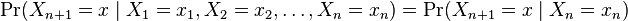

Introduction of SwiftKey Data Product - Typing Prediction
========================================================
author: Tianxiang(Ivan) Liu
date: 25 November 2014
transition: rotate
class: illustration
rtl: false
css: custom.css

Mobile Typing Prediction
========================================================
type: sub-section
incremental: false

- <b>**Prediction Algorithm**</b> 
    - High accuracy - ~~Katz back-off~~
    - Small size - ~~36 mb~~
    - Quick predictive response - ~~0.000~0.003 s~~ 
- <b>**Instructions**</b>
    - Input - ~~sentence (1~4 words)~~
    - Output - ~~top 5 possible words / wordcloud plot~~
- <b>**Experience of Application**</b>
    - App interface
    - Documents

Prediction Algorithm
========================================================
type: sub-section
incremental: false
- <b>**Computing Possibilities**</b>
    - Markov Chain
- <b>**Smoothing**</b> 
    - Kat back-off
    
Instructions
========================================================
type: sub-section
incremental: false
- <b>**Text Input**</b>
- <b>**Prediction Outcomes**</b>
    - Word prediction
    - Wordcloud

Experience of App
========================================================
type: sub-section
incremental: false
- <b>**Predictive Model**</b>
- <b>**App Workflow**</b>
- <b>**Key Concepts**</b>

