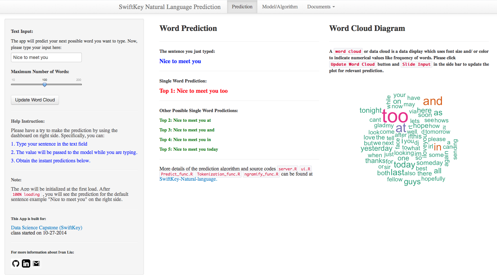

Introduction of SwiftKey Data Product - Mobile Typing Prediction
========================================================
author: Tianxiang(Ivan) Liu
date: 25 November 2014
transition: rotate
class: illustration
rtl: false
navigation: slide
font-family: 'Risque'
css: custom.css
width: 1024
height: 768

Outline
========================================================
type: prompt
- <b>**Prediction Algorithm**</b>
    - Efficient Modelling - ~~Markov Chain / Katz back-off~~
    - Cleaned/Compressed Datasets - ~~580MB -> 36MB~~
    - Quick predictive response - ~~0.000~0.003s~~ 
- <b>**Instructions**</b>
    - Input - ~~Sentence (truncate the last 1~4 words)~~
    - Output - ~~Top possible words / Wordcloud visualization~~
- <b>**Experience of Application**</b>
    - User Interface - ~~Shiny server / Amazon EC2~~
    - Manual / Documents 

Prediction Algorithm
========================================================
type: prompt
- <b>**Markov Chain**</b> 
<small>A mathematical system that undergoes transitions from one state to another on a state space. </small>
    
- <b>**Kat back-off**</b> 
A generative ngram language model that estimates the conditional probability of a word given its history.
    
    
Instructions
========================================================
<b>**Input**</b>
-
Users type their sentence into the text field of app.
System will truncate the last 1~3 words 
and take them as input of predictive algorithm. 
  

***
<b>**Output**</b>
-
- Word prediction 

- Wordcloud 

Experience of App
========================================================
type: prompt
<b>**App Constructure**</b> 
-

***
<b>**User Interface**</b>
-

<b>**Manual Documents**</b>
-
- Predictive Model / App Workflow / Teminology
- Interim Report / Final Presentation
